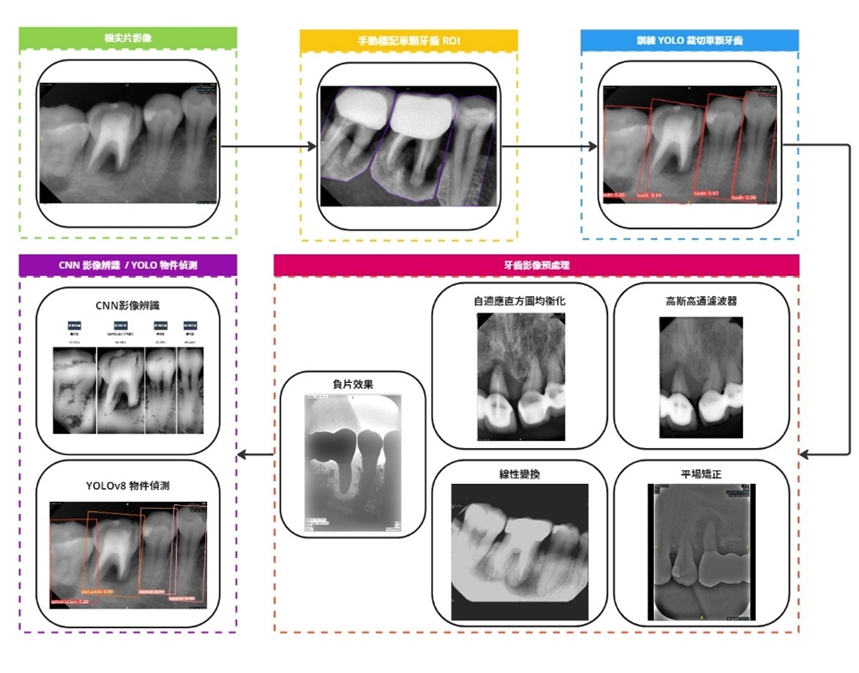
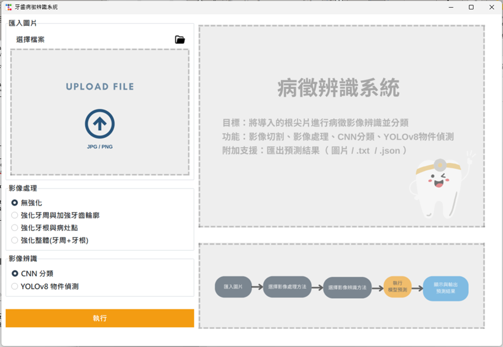
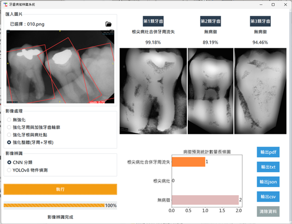
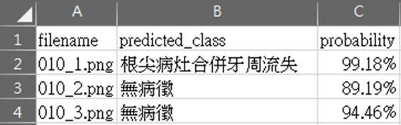

## 牙齒影像分析偵測系統

本作品為牙齒病徵的影像分析偵測系統，能提升病徵早期偵測與治療效率，為口腔健康管理帶來更智能、更精準的解決方案。

 

 

### 一、影像處理

使用者可選擇不同的影像處理任務。總共分為四種模式：無強化、 強化牙周與加強牙齒輪廓、強化牙根與病灶點、強化整體(牙周+牙根)。不同任務對應不同的影像強化模式與不同參數調整，使用者可以根據目標檔案的清晰度、牙齒輪廓、細節選擇不同的影像預處理，透過交叉比對試驗，以獲取最適合的影像預處理方式與預測結果。

### 二、影像辨識

此階段可分為CNN模型與YOLOv8物件偵測模型。首先是CNN模型，本作品使用六種不同的CNN模型，包括AlexNet、Places365-GoogLeNet、VGG-16、ResNet50、GoogLeNet和ConvNeXt。我們的目標是綜合考慮這六個模型的預測，並使用相同的權重對每個類別的機率進行加權平均。透過這種方法，能夠確定最有可能的類別並計算出其最終的概率值，以提高預測的準確性和可靠性，並為最終結果提供更有說服力的支持。另一方面，YOLOv8物件偵測模型則是一種針對物件偵測任務而設計的模型。這裡採用的是YOLOv8-OBB（定向邊界框）版本，它能夠準確地對導入的根尖片直接檢測影像中的物件並標記出其定向邊界框，不需先進行影像切割，進而優化影像辨識的繁瑣步驟，提高效率。

### 三、顯示預測圖像

系統右上方將呈現影像處理的預測結果。對於CNN卷積神經網路模型，預測結果將根據根尖片中牙齒的排列順序由左至右進行展示，並在每顆牙齒的下方呈現預測結果和對應的分類標籤，如圖 21 所示。YOLOv8-OBB模型則會顯示完整根尖片影像的預測結果，同時在圖片上以不同顏色的Bounding Box標記出目標位置並附上分類標籤。系統右下方則將以視覺化的方式展示目標單張根尖片所預測的各類別牙齒總數量，透過長條圖將數據資料視覺化，進一步提供使用者對於預測結果的直觀了解，有助於快速理解和分析模型的辨識結果，使用者可以輕鬆地獲取關於影像處理的重要訊息。

 

### 四、儲存與匯出預測結果、清除資料

我們提供了六種按鈕功能：輸出PDF（CNN分類結果）、輸出圖片（YOLOv8物件偵測結果）、輸出txt（純文字格式）、輸出JSON格式、輸出CSV格式，以及清除資料功能。可用不同的輸出格式輸出，方便使用者保存、分享和後續處理預測結果，並提升系統的操作效率和使用體驗。

 